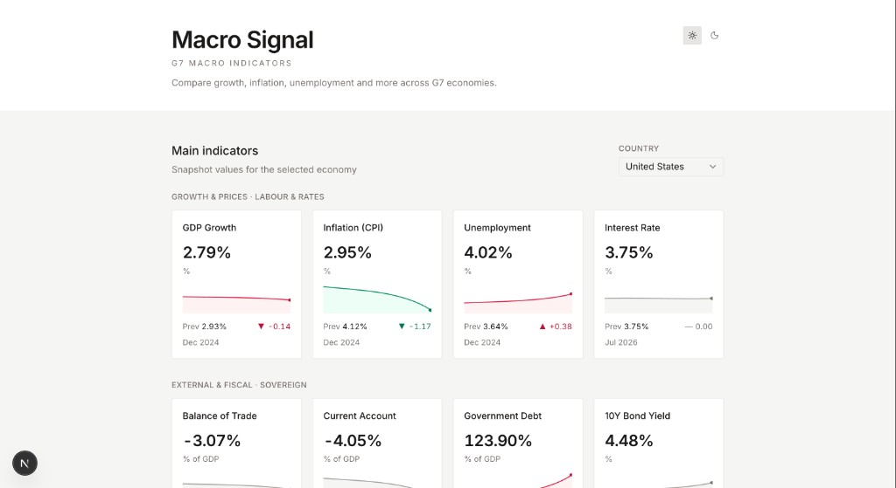

# Macro Signal

A G7 macroeconomic analytics — snapshot cards, a 25-year two-country comparison chart with rule-based insights, and a multi-country scanner table. The data layer mirrors the TE snapshot/historical shapes behind `lib/te.ts`, with live series fetched from open providers through a per-indicator adapter (see *Architecture*).



## Live demo

**[View live demo →](https://macro-signal.vercel.app)**

## Features

- **Main indicators** — snapshot cards with latest value, previous reading, delta, and sparkline per indicator (country selector). Deltas and sparklines are colored by economic meaning, not raw direction — rising unemployment shows red, rising GDP green — while indicators without a fixed valence (policy rates, bond yields, external balances) stay neutral.
- **Comparison** — overlay any two G7 economies on one indicator (~25 years), with a generated one-line insight (consecutive-trend and crossover detection, pure logic — no AI calls)
- **G7 at a glance** — 7 countries × 8 indicators across two scanner tables; row click highlights a country in the glance view
- Dark/light theme, responsive, zero client-side API keys

**G7 economies:** United States, Canada, Japan, Germany, France, United Kingdom, Italy.

## Architecture & data sources

Trading Economics confirmed by email (July 2026) that guest keys and free developer accounts have been discontinued. The frozen 8-indicator catalog in `lib/catalog.ts` is the single source of truth for cards and both G7 tables. `lib/te.ts` routes each indicator by `source` to:

- `lib/wb.ts` — World Bank open API
- `lib/imf.ts` — IMF DataMapper API
- `lib/fred.ts` — FRED (policy rates + 10Y yields)

Historical data is also exposed at `GET /api/series?symbols=usa.fp.cpi.totl.zg,...`.

| Indicator | Source | Series |
|---|---|---|
| GDP Growth | World Bank | `NY.GDP.MKTP.KD.ZG` |
| Inflation (CPI) | World Bank | `FP.CPI.TOTL.ZG` |
| Unemployment | World Bank | `SL.UEM.TOTL.ZS` |
| Interest Rate | FRED | per-country (see ¹) |
| Balance of Trade | World Bank | `NE.RSB.GNFS.ZS` |
| Current Account | World Bank | `BN.CAB.XOKA.GD.ZS` |
| Government Debt | IMF DataMapper | `GGXWDG_NGDP` |
| 10Y Bond Yield | FRED | `IRLTLT01{CC}M156N` |

¹ **Interest rate series (verified Jul 2026):** CAN `IRSTCI01CAM156N` (BoC call-money; `IRSTCB01CAM156N` discontinued); JPN `IRSTCI01JPM156N` (BoJ overnight call; `IRSTCB01JPM156N` discontinued); USA `DFEDTARU` (`IRSTCB01USM156N` missing); GBR `IUDSOIA` / SONIA (`IRSTCB01GBM156N` missing); DEU/FRA/ITA `ECBDFR` (euro area ECB deposit facility rate). Methodology note shown under the fiscal G7 table.

Indicators were selected for **complete live coverage across all G7 economies** (56/56 cells). Series with partial coverage (real interest rate, credit rating, central-government debt) were excluded.

```bash
USE_MOCK=false FRED_API_KEY=your_key npm run verify-catalog
```

All fetches are server-side with hourly revalidation; keys never reach the client. With `USE_MOCK=true`, the app serves bundled fixtures only. In live mode, missing `FRED_API_KEY` falls back to fixtures for FRED indicators (console warning); WB and IMF errors surface as empty cells or API errors.

### Data freshness

Sources publish at different frequencies: World Bank series are annual (latest actual year, currently 2024); IMF WEO is annual with actuals/estimates through 2025 — projection years are deliberately excluded; FRED rate/yield series are monthly (latest available observation). Each card and cell shows the true as-of date of its underlying data point rather than a normalized date.

## Tech stack

Next.js · TypeScript · Recharts · shadcn/ui · Tailwind CSS

## Getting started

```bash
npm install
cp .env.example .env.local   # defaults to USE_MOCK=true for offline dev
npm run dev
```

| Variable | Required | Purpose |
|---|---|---|
| `FRED_API_KEY` | for live rate/yield data | Interest rate + 10Y bond yield ([free key](https://fred.stlouisfed.org/docs/api/api_key.html)) |
| `USE_MOCK` | optional (`true` in `.env.example`) | Fully offline fixtures via `lib/mock/fixtures.json` |

## Scripts

```bash
npm run dev              # local development
npm run build            # production build
npm run lint             # ESLint
npm run verify-catalog   # live 7×8 coverage matrix (needs FRED_API_KEY)
npm run generate-mock    # regenerate offline fixtures
```

## Author

[Fabio Coelho](https://www.fbclh.io/) · [GitHub](https://github.com/fbclh) · [LinkedIn](https://www.linkedin.com/in/fbclh/)

## Attribution

Data provided by the [World Bank](https://data.worldbank.org/), [IMF DataMapper](https://www.imf.org/external/datamapper/), and [FRED](https://fred.stlouisfed.org/) (Federal Reserve Bank of St. Louis).

## License

MIT — see [LICENSE](LICENSE).

